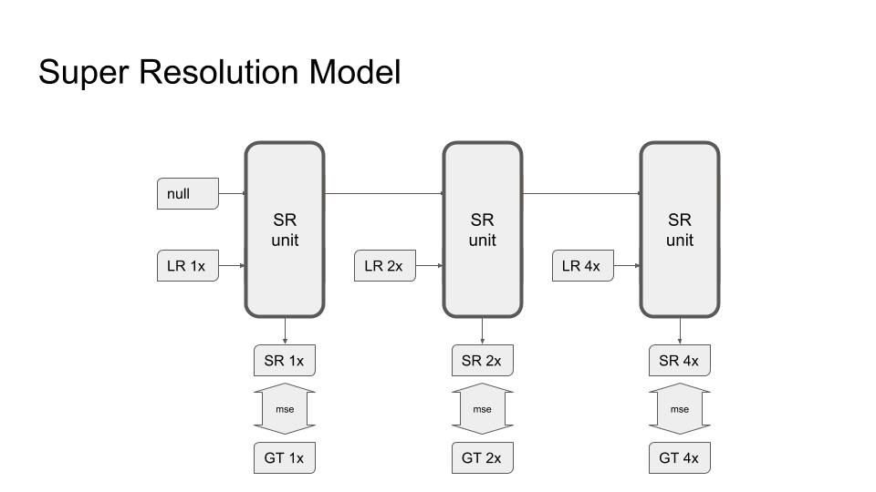

# Draft

## Model




## Required Packages

- imageio
- numpy
- scipy
- tensorflow (1.12.0)

## Reproduce the Result

- clone this project and change directory to here (ml_competitions/ntire2019_image_super_resolution/).
- `mkdir checkpoints`
- `mkdir results`
- download [checkpoint](https://drive.google.com/file/d/1XQw2fGY8R8gqcgqOn9lkrjZdGJlWbaHH/view?usp=sharing), unzip it to `checkpoints`.
- run the following script

```
python3 experiment_test.py \
    --checkpoint_path=./checkpoints/model.ckpt-130000 \
    --testing_image_source_dir_path=/path/to/Test_LR/ \
    --testing_patch_size=128 \
    --testing_overlapping_size=32 \
    --testing_result_path=./results/results.zip
 ```

 - a zip file will be generated within `./results/` which is as the one submitted to CodaLab.